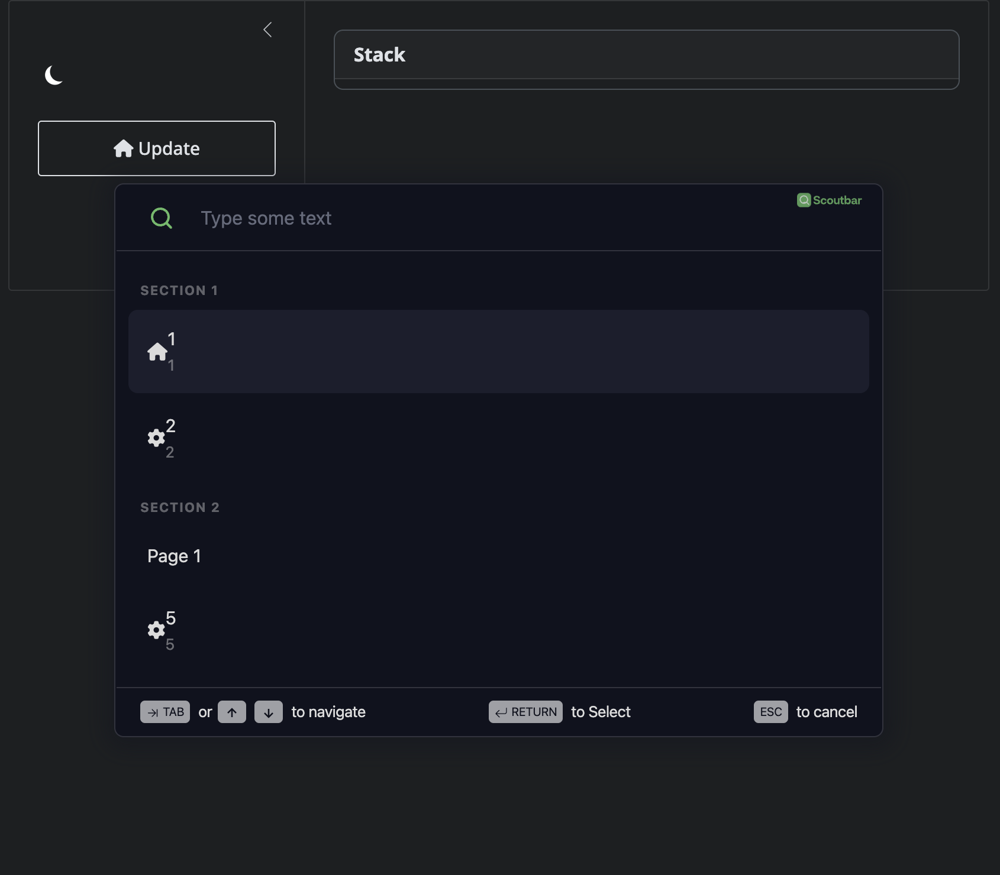
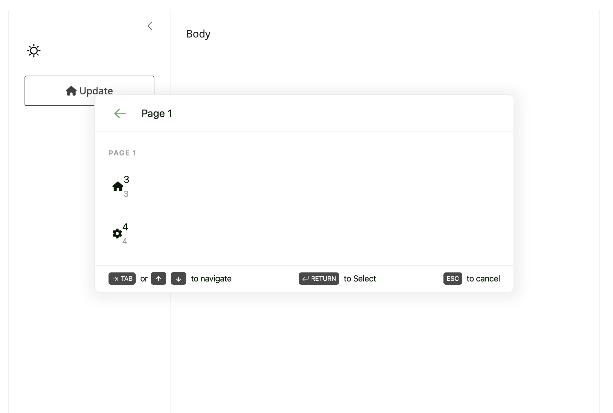

<!-- README.md is generated from README.Rmd. Please edit that file -->

# {scoutbaR}

<!-- badges: start -->

[](https://lifecycle.r-lib.org/articles/stages.html#experimental)
[](https://github.com/cynkra/scoutbaR/actions/workflows/R-CMD-check.yaml)
[](https://app.codecov.io/gh/cynkra/scoutbaR?branch=main)
[](https://CRAN.R-project.org/package=scoutbaR)
<!-- badges: end -->

The goal of `{scoutbaR}` is to provide an R API to the `scoutbar` React
[widget](https://www.scoutbar.co/).




## Installation

You can install the development version of `{scoutbaR}` from
[GitHub](https://github.com/) with:

``` r
# install.packages("devtools")
devtools::install_github("cynkra/scoutbaR")
```

## Example

`{scoutbaR}` is easy to use. The app below shows how to leverage
`scout_action()`, `scout_section()` and `scout_page()`:

``` r
library(scoutbaR)
library(shiny)
library(bslib)

ui <- page_fillable(
  title = "Penguins dashboard",
  layout_sidebar(
    sidebar = sidebar(
      input_dark_mode(id = "theme"),
      actionButton("update", "Update", icon = icon("house")),
      scoutbar(
        "scoutbar",
        actions = list(
          scout_section(
            label = "Section 1",
            scout_action(
              id = 1,
              icon = "house",
              label = "1",
              description = "1"
            ),
            scout_action(
              id = 2,
              icon = "gear",
              label = "2",
              description = "2"
            )
          ),
          scout_section(
            label = "Section 2",
            scout_page(
              label = "Page 1",
              scout_action(
                id = 3,
                icon = "house",
                label = "3",
                description = "3"
              ),
              scout_action(
                id = 4,
                icon = "gear",
                label = "4",
                description = "4"
              )
            ),
            scout_action(
              id = 5,
                icon = "gear",
                label = "5",
                description = "5"
            )
          )
        )
      ),
      textOutput("textOutput"),
      textOutput("current_tab")
    ),
    "Body"
  )
)

server <- function(input, output, session) {

  observeEvent(input$update, {
    update_scoutbar(session, "scoutbar", revealScoutbar = TRUE)
  })

  observeEvent(input$theme, {
    update_scoutbar(session, "scoutbar", theme = input$theme)
  })
  output$textOutput <- renderText({
    sprintf("You entered: %s", input$scoutbar)
  })
}

shinyApp(ui, server)
```
